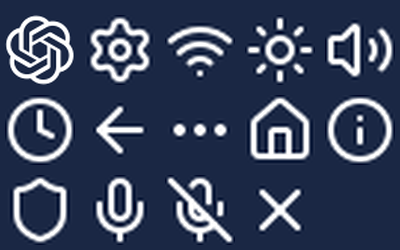
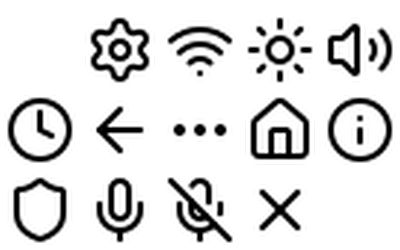

# Watch Icons - Source & License Attribution

## Verification

### Navy Background Render


### Contact Sheet (White on Transparent)


## Icon Sources

### ChatGPT Logo
- **Source:** `chat.openai.com/favicon.svg` (official OpenAI favicon)
- **Size:**52×52 pixels (for96px tile center)
- **Format:** A8 (alpha-only mask)
- **Usage:** The ChatGPT knot logo, rendered from the official ChatGPT web app favicon SVG. The SVG path data was extracted from the live `chat.openai.com/favicon.svg` endpoint on2026-09-06.

### Control Icons (Lucide)
- **Source:** [Lucide Icons](https://lucide.dev) - `lucide-static@latest` v1.41.0
- **License:** ISC License (permissive, similar to MIT)
- **Size:**24×24 pixels
- **Format:** A8 (alpha-only masks)
- **Rendering:** SVGs rendered with white stroke via rsvg-convert; alpha channel extracted (not luminosity)

| Icon Name | Lucide Icon | Purpose |
|-----------|-------------|---------|
| settings | `settings` | Gear/settings |
| wifi | `wifi` | WiFi status |
| sun | `sun` | Brightness |
| volume | `volume-2` | Volume control |
| clock | `clock` | Timer/clock |
| back | `arrow-left` | Back navigation |
| more | `ellipsis` | More options |
| home | `home` | Home screen |
| info | `info` | Information |
| shield | `shield` | Privacy/security |
| mic | `mic` | Microphone active |
| mic_off | `mic-off` | Microphone muted |
| close | `x` | Close/dismiss |

## License Text (Lucide ISC License)

> ISC License
>
> Copyright (c) for portions of Lucide are held by Cole Bemis2013-2022 as part of Feather (ISC). All other copyright (c) for Lucide are held by Lucide Contributors2022.
>
> Permission to use, copy, modify, and/or distribute this software for any purpose with or without fee is hereby granted, provided that the above copyright notice and this permission notice appear in all copies.
>
> THE SOFTWARE IS PROVIDED "AS IS" AND THE AUTHOR DISCLAIMS ALL WARRANTIES WITH REGARD TO THIS SOFTWARE INCLUDING ALL IMPLIED WARRANTIES OF MERCHANTABILITY AND FITNESS. IN NO EVENT SHALL THE AUTHOR BE LIABLE FOR ANY SPECIAL, DIRECT, INDIRECT, OR CONSEQUENTIAL DAMAGES OR ANY DAMAGES WHATSOEVER RESULTING FROM LOSS OF USE, DATA OR PROFITS, WHETHER IN AN ACTION OF CONTRACT, NEGLIGENCE OR OTHER TORTIOUS ACTION, ARISING OUT OF OR IN CONNECTION WITH THE USE OR PERFORMANCE OF THIS SOFTWARE.

## Technical Details

### A8 Format
All icons use LVGL's `LV_COLOR_FORMAT_A8` (alpha-8) format:
-1 byte per pixel (alpha value0-255)
- Fully tintable at runtime using `lv_obj_set_style_img_recolor()`
- White icons can be recolored to any color
- Memory efficient for monochrome icons

### LVGL Integration
```cpp
#include "display/watch_icons.h"

// Use in LVGL image widget
lv_obj_t* img = lv_image_create(parent);
lv_image_set_src(img, &watch_icons::chatgpt);

// Tint to desired color
lv_obj_set_style_img_recolor(img, lv_color_hex(0xFFFFFF),0);
lv_obj_set_style_img_recolor_opa(img, LV_OPA_COVER,0);
```

### Build Notes
- No new runtime dependencies
- No external image loading at runtime
- All image data compiled into firmware as const arrays
- Header provides `extern` declarations for namespace `watch_icons`

## File Locations

- **Header:** `main/display/watch_icons.h`
- **Source:** `main/display/watch_icons.cc`
- **Navy Verification:** `documentation/watch-icons-navy.png`
- **Contact Sheet:** `documentation/watch-icons-contact-sheet.png`
- **This File:** `documentation/watch-icons.md`

